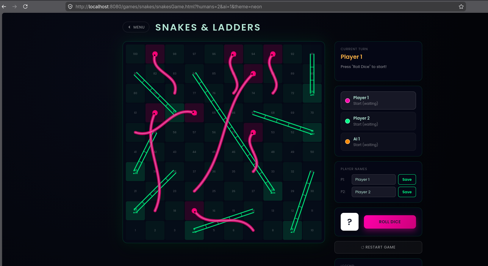

# BoardVerse

BoardVerse is a high-fidelity HTML5 board game hub designed for large displays (1920×1080 and beyond). It showcases a modern grid of classic titles, routes players into configurable game menus, and provides fully playable or placeholder game screens.

## Highlights
- Responsive glassmorphism UI tailored for desktop and tablet resolutions
- Modular ES6 architecture with a single game registry (`js/data/games.js`)
- Rich CSS animations, hover effects, and Google Fonts typography
- Reusable configuration menus (players, difficulty, theme) for every game
- Snakes & Ladders fully implemented: 2–4 players (human + AI mix), three visual themes, player name editing, snake/ladder SVG overlays, and win detection
- Placeholder screens for Chess, Checkers, and Ludo — ready to be replaced with full game engines

## Gameplay Preview



## Project Structure
```
.
├── index.html                # Main hub landing page
├── assets/
│   └── images/               # SVG placeholders for each game card
├── js/
│   ├── data/games.js         # Registry that powers the hub and menus
│   ├── main.js               # Hub grid rendering logic
│   ├── gameMenu.js           # Shared menu interactions
│   └── gameRuntime.js        # Placeholder runtime for game screens
├── games/
│   ├── chess/                # Chess menu + placeholder game screen
│   ├── checkers/             # Checkers menu + placeholder game screen
│   ├── ludo/                 # Ludo menu + placeholder game screen
│   └── snakes/               # Snakes & Ladders — fully playable game
└── styles/
    ├── main.css              # Hub styling
    ├── menu.css              # Shared menu styling
    ├── gamePlaceholder.css   # Placeholder game screen styling
    └── snakesGame.css        # Snakes & Ladders game screen styling
```

## Getting Started
1. Serve the project with any static file server (e.g. `npx http-server`, `python -m http.server`, or a Live Server extension).
2. Open `index.html` in your browser.
3. Explore the hub, open a game menu, tweak options, and launch the placeholder game page to verify the configuration flow.

## Adding a New Game
1. **Update the registry** – Add an entry to `js/data/games.js` with the game id, name, image, and menu/play page paths.
2. **Create assets** – Add the game’s SVG/PNG artwork to `assets/images/`.
3. **Create menu + game screen** – Duplicate an existing folder under `games/`. For a placeholder, adjust the `data-game-id` and wire a `<gameId>Game.js` that calls `initGamePlaceholder(‘<gameId>’)`. For a full implementation, use `games/snakes/` as a reference for structure.

When implementing real gameplay, replace the placeholder HTML/CSS/JS inside the game folder with your actual engine while keeping the URL routing intact.

## Tech Stack
- HTML5 with semantic structure
- Modern CSS (Flexbox, Grid, transitions) for responsive layouts
- Vanilla JavaScript ES6 modules for modularity
- Lightweight static assets (SVG illustrations) for crisp 4K rendering
